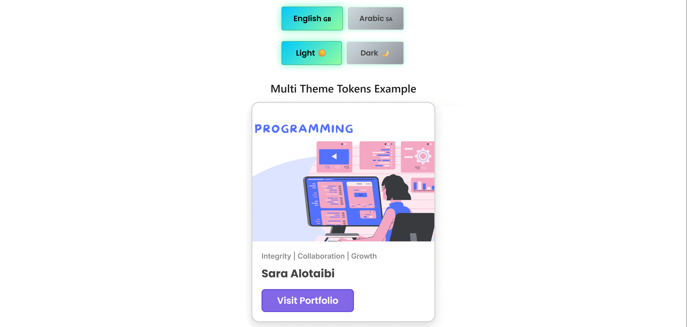

# 🎨 Multi Theme Card – Light, Dark, English & Arabic 🌗🌍

## 👋 Explore My Interactive Themed Card

This project showcases a card component with **multi-theme** and **multi-language** support. It allows users to toggle between:

- 🌞 Light Mode
- 🌙 Dark Mode
- 🇬🇧 English
- 🇸🇦 Arabic (RTL layout)

All styles are powered by **design tokens** and built with a scalable approach using Figma Variables.

---

## 🧩 What’s Inside

- **🌗 Theme Switcher** – Light and Dark modes with smooth token transitions  
- **🌍 Language Toggle** – English and Arabic UI with RTL support  
- **🎯 Token Strategy** – Includes:
  - **Option Tokens** – Raw values (colors, spacing, radius)
  - **Alias Tokens** – Semantic tokens (e.g., `color.text.primary`)
  - **Component Tokens** – Custom styles for the Card component  
- **📐 Figma Variables** – Tokens mapped and organized in Figma  
- **💻 Responsive UI** – Works on all screen sizes

---

## 🚀 Why It Matters

This project is a practical example of how to:

- Use **tokens** to build flexible, maintainable UI  
- Sync **design and development** using a design system approach  
- Support **internationalization** with RTL and LTR layouts  
- Create theme-ready components for real-world apps  

---

## 👩‍💻 Built By

**Sara Alotaibi**  
Full Stack Developer

👉 [Visit My Portfolio](https://saraaydh.netlify.app/) to see more real-world builds like this!

